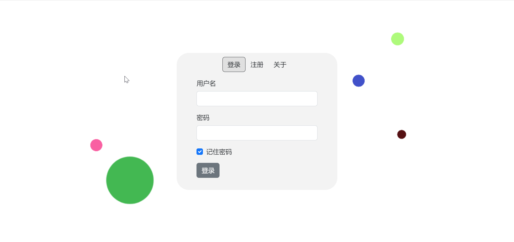

# 🏠 沙盒小镇


欢迎来到多人网络沙盒小镇！在这里，你将扮演一位勇敢的冒险家，探索神秘的建筑，遭遇奇特的生物，收集稀有的物品。你需要战斗、购买装备、驯服精灵，提升自己的力量，因为当夜晚降临，幽灵和蜘蛛会在黑暗中出没。

🏰 **建筑与地图** 沙盒小镇拥有一个广阔的世界，神秘的建筑散布各处，等待你去探索。耸立的神庙能庇护你免受怪物侵扰，而阴森的墓地则潜藏着亡灵的威胁。当你疲惫时，可以采摘果树上的苹果，恢复体力；当你需要装备时，可以前往商店购买有用的物资。

👥 **丰富的角色** 在沙盒小镇中，你将扮演一位冒险家，遭遇形形色色的生物。你可以驯服忠诚的狗，让它成为你的助手和伙伴。当夜晚降临，幽灵和蜘蛛会在黑暗中出没，你需要时刻保持警惕。

💍 **物品系统** 游戏中有各种稀有的物品等待你去收集，从普通的木头、石头，到珍贵的凤凰之羽、飞翔靴等。合理利用这些物品，可以帮助你在游戏中更快地成长。商店是买卖物品的理想之地，你可以在这里售卖收集到的物资，购买需要的装备。

🌄 **时间系统** 沙盒小镇拥有独特的时间系统，你将在昼夜更替中体验不同的奇遇。白天可以自由探索，而夜晚则危机四伏。某些生物只在特定时段出现，某些事件只在特定时刻发生。

⚔️ **战斗与成长** 在沙盒小镇的冒险中，你将通过战斗不断成长。击败怪物不仅可以获得宝贵的经验，提升等级永久强化自身属性，还能获得相应的金币和特定物品。装备或使用这些物品，能获得属性提升，如速度加成；有些物品还能为你附加特殊效果，如火焰附体，让你在战斗中如虎添翼。勇敢地战斗吧，朋友！

🤝 **多人互动** 沙盒小镇支持多人游戏，你可以在这里认识志同道合的朋友，与他们一起冒险，互帮互助。

在沙盒小镇这片沙盒世界中，创造专属于你的冒险故事吧！

## 技术选型

- 前端框架：Vue
- 游戏引擎：Phaser.js
- 通信协议：WebSocket & HTTP
- 后端框架：SpringBoot
- 持久层：MariaDB & MyBatis
- 缓存：Redis
- 安全框架：Sa-Token

## 构建方法

```bash
cp sandbox_town_backend/src/main/resources/application.template.yml \
   sandbox_town_backend/src/main/resources/application.yml
cp sandbox_town_db/customer.template.cnf sandbox_town_db/customer.cnf
cp sandbox_town_frontend/nginx.template.conf sandbox_town_frontend/nginx.conf
cp docker-compose.template.yml docker-compose.yml
cp docker-compose.dev.template.yml docker-compose.dev.yml
cp docker-compose.prod.template.yml docker-compose.prod.yml
```

- 按需修改上述配置文件
- 生产环境：`docker-compose -f docker-compose.yml -f docker-compose.prod.yml up -d`
- 开发环境：
   - 在 `sandbox_town_frontend` 目录下执行 `npm install`
   - 在 `sandbox_town_backend` 目录下执行 `mvn package`
   - `docker-compose -f docker-compose.yml -f docker-compose.dev.yml up -d`

开发环境和生产环境的主要区别：

- 开发环境支持热部署
- 开发环境暴露了MySQL(3306)和Redis(6379)等端口方便调试

## 文档

- [建筑列表](doc/building.md)
- [精灵列表](doc/sprite.md)
- [效果列表](doc/effect.md)
- [物品列表](doc/item.md)
- [融合公式](doc/fusion.md)

## 游戏截图

### 登录界面



### 物品融合界面


### 装备栏


### 物品界面


### 商店界面


### 森林


### 城镇


### 迷宫


## 素材来源

- https://www.bing.com/create 所有建筑、角色、物品的素材
- https://cupnooble.itch.io/sprout-lands-asset-pack 背景纹理和围墙
- https://remixicon.com/ 箭头、搜索等图标

## License

[MIT](./LICENSE)
