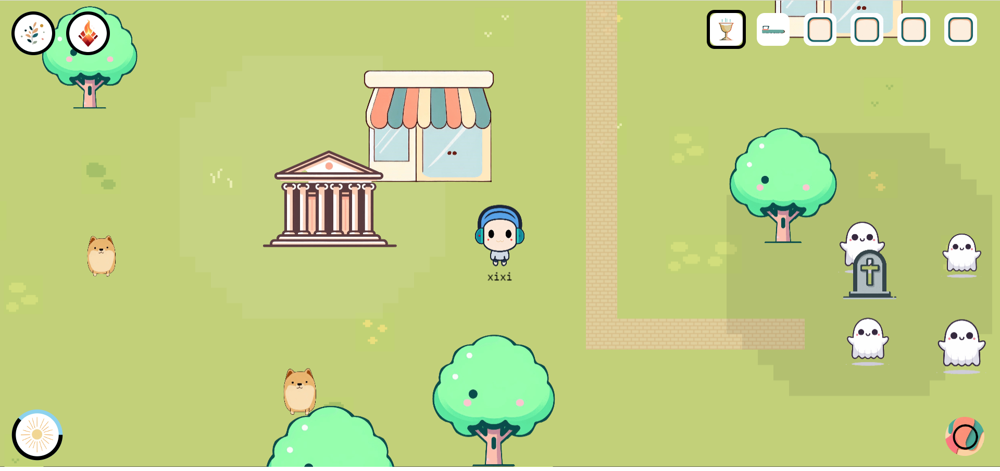

# 🏠 沙盒小镇



欢迎来到多人网络沙盒小镇！在这里，你将扮演一位勇敢的冒险家，探索神秘的建筑，遭遇奇特的生物，收集稀有的物品。你需要战斗、购买装备、驯服精灵，提升自己的力量，因为当夜晚降临，幽灵和蜘蛛会在黑暗中出没。

🏰 **建筑与地图** 沙盒小镇拥有一个广阔的世界，神秘的建筑散布各处，等待你去探索。耸立的神庙能庇护你免受怪物侵扰，而阴森的墓地则潜藏着亡灵的威胁。当你疲惫时，可以采摘果树上的苹果，恢复体力；当你需要装备时，可以前往商店购买有用的物资。

👥 **丰富的角色** 在沙盒小镇中，你将扮演一位冒险家，遭遇形形色色的生物。你可以驯服忠诚的狗，让它成为你的助手和伙伴。当夜晚降临，幽灵和蜘蛛会在黑暗中出没，你需要时刻保持警惕。

💍 **物品系统** 游戏中有各种稀有的物品等待你去收集，从普通的木头、石头，到珍贵的凤凰之羽、飞翔靴等。合理利用这些物品，可以帮助你在游戏中更快地成长。商店是买卖物品的理想之地，你可以在这里售卖收集到的物资，购买需要的装备。

🌄 **时间系统** 沙盒小镇拥有独特的时间系统，你将在昼夜更替中体验不同的奇遇。白天可以自由探索，而夜晚则危机四伏。某些生物只在特定时段出现，某些事件只在特定时刻发生。

⚔️ **战斗与成长** 在沙盒小镇的冒险中，你将通过战斗不断成长。击败怪物不仅可以获得宝贵的经验，提升等级永久强化自身属性，还能获得相应的金币和特定物品。装备或使用这些物品，能获得属性提升，如速度加成；有些物品还能为你附加特殊效果，如火焰附体，让你在战斗中如虎添翼。勇敢地战斗吧，朋友！

🤝 **多人互动** 沙盒小镇支持多人游戏，你可以在这里认识志同道合的朋友，与他们一起冒险，互帮互助。

在沙盒小镇这片沙盒世界中，创造专属于你的冒险故事吧！

## 技术选型

- 前端框架：Vue
- 游戏引擎：Phaser.js
- 通信协议：WebSocket & HTTP
- 后端框架：SpringBoot
- 持久层：MariaDB & MyBatis
- 缓存：Redis
- 安全框架：Sa-Token

## 构建方法

```bash
cp sandbox_town_backend/src/main/resources/application.template.yml \
   sandbox_town_backend/src/main/resources/application.yml
cp sandbox_town_db/customer.template.cnf sandbox_town_db/customer.cnf
cp sandbox_town_frontend/nginx.template.conf sandbox_town_frontend/nginx.conf
cp docker-compose.template.yml docker-compose.yml
cp docker-compose.dev.template.yml docker-compose.dev.yml
cp docker-compose.prod.template.yml docker-compose.prod.yml
```

- 按需修改上述配置文件
- 生产环境：`docker-compose -f docker-compose.yml -f docker-compose.prod.yml up -d`
- 开发环境：
   - 在 `sandbox_town_frontend` 目录下执行 `npm install`
   - 在 `sandbox_town_backend` 目录下执行 `mvn package`
   - `docker-compose -f docker-compose.yml -f docker-compose.dev.yml up -d`

开发环境和生产环境的主要区别：

- 开发环境支持热部署
- 开发环境暴露了MySQL(3306)和Redis(6379)等端口方便调试

## 游戏截图

请参见[游戏截图](doc/screenshot.md)

## 功能介绍

### 账号模块

- 玩家需要注册账号（提供用户名和密码）和登录账号才能进行游戏
- 可以保持登录7天，也可以不记住密码
- 玩家可以登出账号
- 具有admin权限的用户（管理员）可以封禁和解封普通玩家
- 登录奖励：如果是新用户或者超过30天没有上线，获得200元奖励；如果1天没有上线，获得40元奖励

### 地图与建筑模块

- 地图通过种子生成
- 地图背景具有草地、花朵等纹理图案，以及迷宫式墙壁
- 玩家可以查看自己的物品栏、效果栏、时间、背包、装备栏
- 玩家点击即可寻路前往终点，如果终点是建筑，到达后会触发相应事件，例如到达商店时打开商店页面

更多信息请参见[建筑列表](doc/building.md)

### 精灵模块

- 精灵包含玩家、宠物、怪物等
- 精灵有金钱、所有者、经验值、等级、饱腹值、血量、攻击、防御、速度、视野、攻击范围等属性
- 经验值达到一定水平后会升级，升级会永久提升自己各方面的属性值，但精灵满级后将无法继续获得经验
- 等级越高，升级所需经验就越多
- 游戏中的精灵饱腹值会定期减少
- 饱腹值大于一定值时定期恢复体力
- 精灵点击可以攻击其他精灵
- 有些精灵可以被驯养，例如狗可以被手持骨头的精灵驯养
- 有些精灵可以被喂食，增加饱腹值和经验值
- 玩家在死亡后经验值归零，扣除一定金钱，并回到出生点。但其他精灵死亡后会消失，其拥有的宠物也同时消失，拥有的建筑变为无主状态
- 精灵击败其他精灵后会提升经验值、获得金币等属性值，并有概率获得特定物品，提升的属性值大小与被击败的精灵的类型和等级均有关
- 玩家右键点击精灵可以查看其资料面板
- 所有夜行动物从黎明开始受到烧伤效果，直到黄昏

更多信息请参见[角色列表](doc/sprite.md)和[效果列表](doc/effect.md)

### 物品模块

- 物品包含食物、装备、武器、用品等类别
- 物品可以放置在背包、物品栏、装备栏等位置
- 物品在被使用、被装备或手持可以为精灵带来属性增益（例如提高速度），或者特殊效果（例如火焰附体效果）
- 物品具有基础价格、稀有度、耐久度等属性

更多信息请参见[物品列表](doc/item.md)，物品融合公式参见[融合公式](doc/fusion.md)

### 时间系统

- 一天包括白天、黄昏、夜晚、黎明
- 每天白天刚开始时，会更新树上的苹果、商店中的商品等等

## 素材来源

- https://www.bing.com/create 所有建筑、角色、物品的素材
- https://cupnooble.itch.io/sprout-lands-asset-pack 背景纹理和围墙
- https://remixicon.com/ 箭头、搜索等图标

## License

[MIT](./LICENSE)
