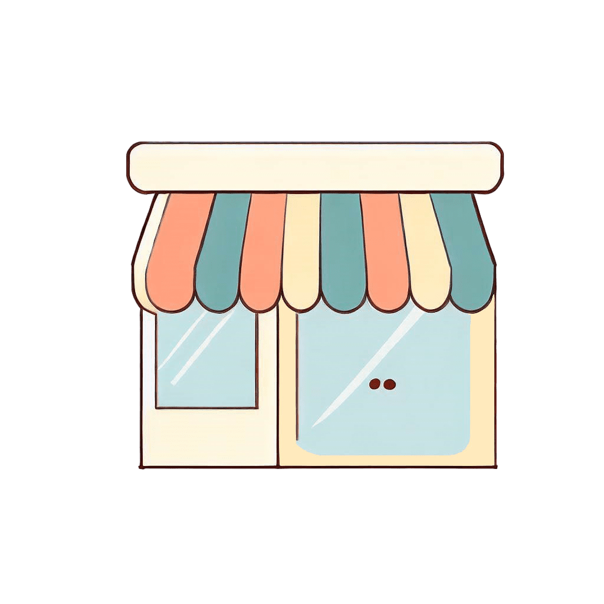

| 建筑名称 | 图像                                                         | 介绍                                                         |
|------| ------------------------------------------------------------ | ------------------------------------------------------------ |
| 树木   |  | 玩家可以摘苹果，但树上的苹果数目有限，每个玩家每天可以摘的苹果数目也有限，不过每天早上树的苹果数目会恢复 |
| 商店   |  | <ul><li>用户可以查看商店的商品，并进行搜索</li><li>玩家可以购买商品</li><li>玩家可以向商店以较低的价格出售商品</li><li>物品具有基础价格，不同商店同一物品的价格虽然不同，但围绕基础价格浮动</li><li>商品每天早上进货，但不同物品具有不同稀有度 </ul> |
| 墓碑   |  | 周围有幽灵出没 |
| 希腊神庙 |  | 敌对生物无法靠近 |