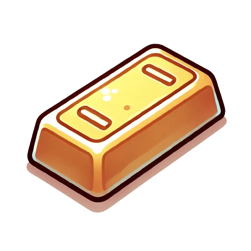
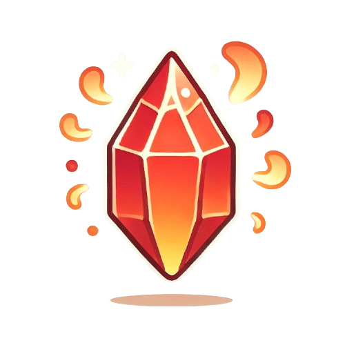
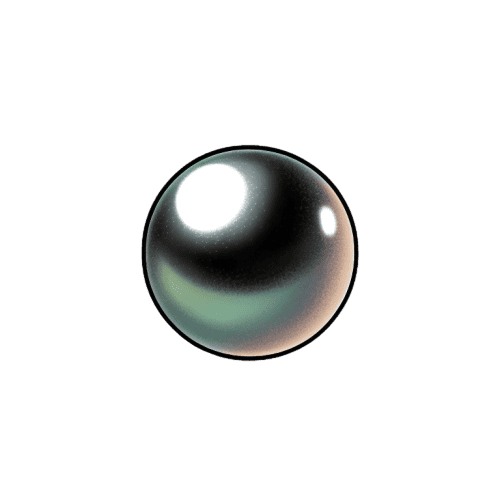
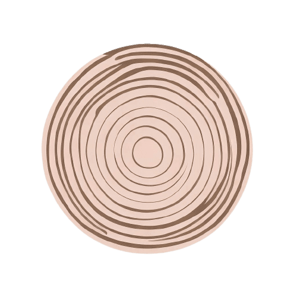
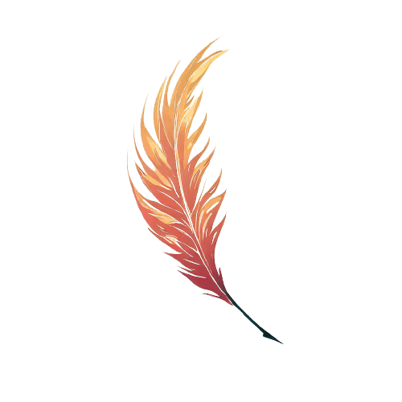
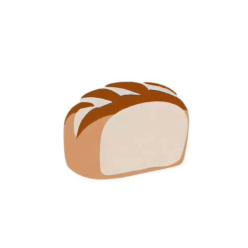

# 物品合成表

| 合成结果 | 所需材料 | 物品描述 |
| --- | --- | --- |
| 圣杯 | 圣杯碎片 ×3, 金 ×2, 魔法草 ×1 | 使疲惫的灵魂和肉体重获新生 |
| 火焰护腿 | 火焰水晶 ×2, 铁 ×3, 木棍 ×1 | 每一步都踏着烈焰 |
| 飞翔靴 | 远古木材 ×2, 金 ×1, 水晶碎片 ×1 | 让风成为你最忠实的伙伴 |
| 隐身帽 | 暗影石 ×2, 黑珍珠 ×1, 木棍 ×2 | 藏匿无影，让敌对生物无法找到你 |
| 铁质头盔 | 铁 ×4, 木头 ×2 | 坚固耐用 |
| 宝箱 | 远古木材 ×1, 石头 ×2 | 打开宝箱，获得随机物品 |
| 凤凰之羽 | 火焰水晶 ×1, 飞翔靴 ×1 | 凤凰的羽毛具有无比强大的火焰和治愈效果 |
| 皮质盔甲 | 皮革 ×3, 丝线 ×1 | 提供基础的防御 |
| 法棍 | 面包 ×10 | 既可以食用，也可以作为攻击武器 |
| 锯子 | 铁 ×2, 木棍 ×2 | 伐木的好帮手 |
