# 物品列表

| 名称 | 图像 | 描述 |
| --- | --- | --- |
| 木头 | 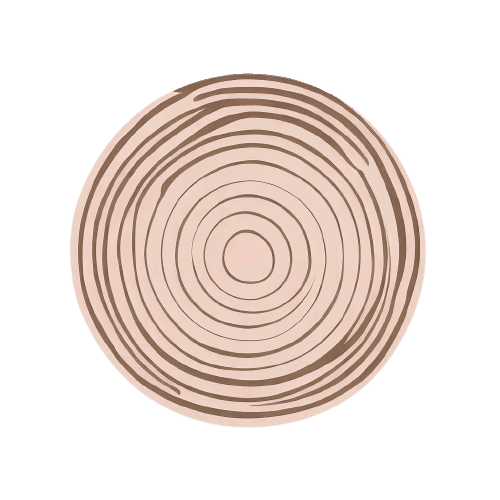 | 建筑的材料，也可处于烤火 |
| 石头 | 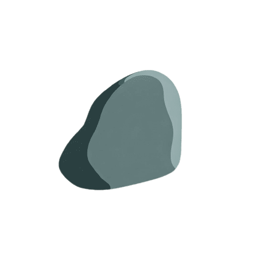 | 用于建造房屋和其他工具 |
| 面包 | 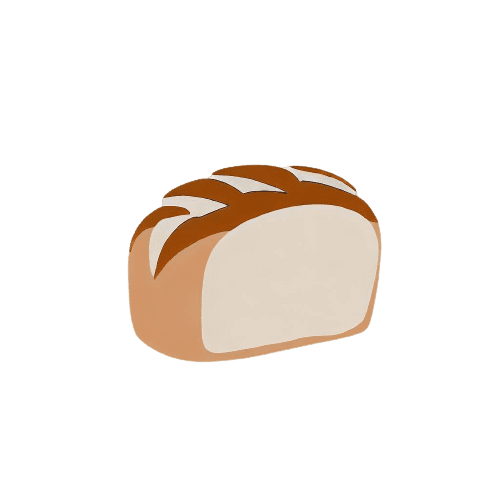 | 具有松软的质地和微甜的口感 |
| 苹果 | 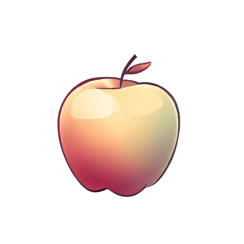 | 禁忌和知识之果 |
| 宝箱 | 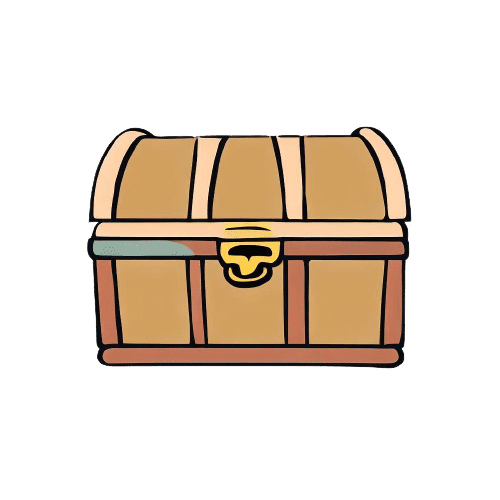 | 打开宝箱，获得随机物品 |
| 飞翔靴 | 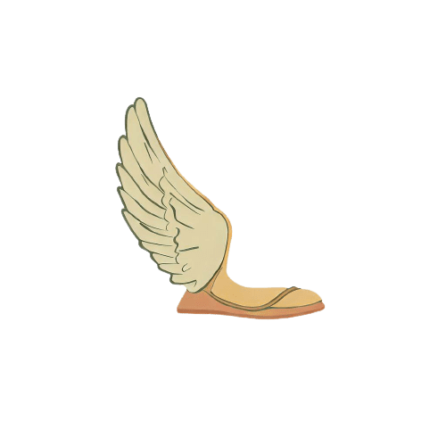 | 让风成为你最忠实的伙伴 |
| 隐身帽 | 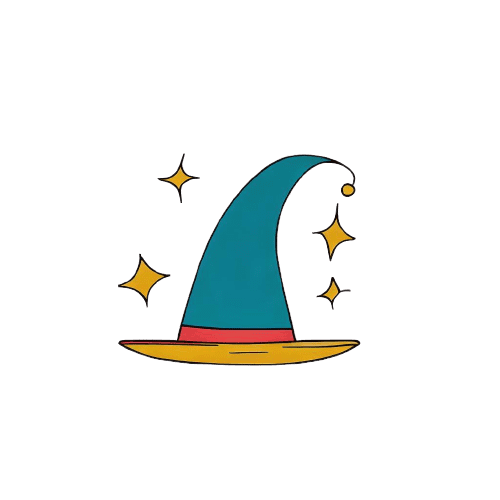 | 藏匿无影，让敌对生物无法找到你 |
| 皮质盔甲 | 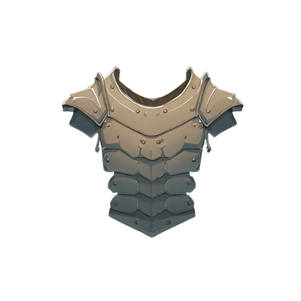 | 提供基础的防御 |
| 锯子 | 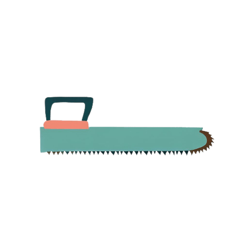 | 伐木的好帮手 |
| 木棍 | 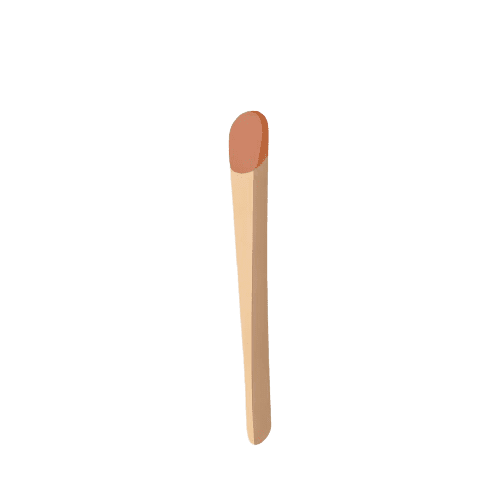 | 基础的攻击武器 |
| 骨头 | 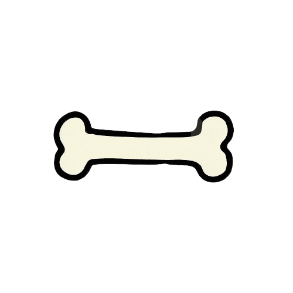 | 狗狗的最爱 |
| 铁质头盔 | 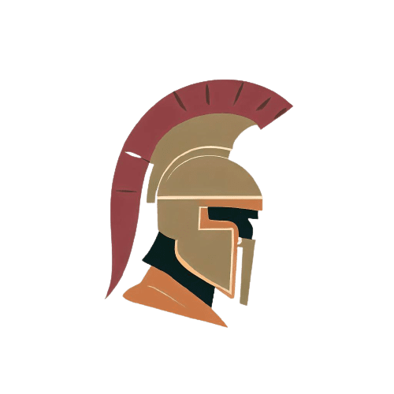 | 坚固耐用 |
| 凤凰之羽 | 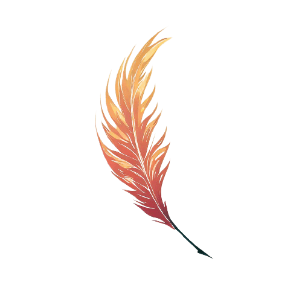 | 凤凰的羽毛具有无比强大的火焰和治愈效果 |
| 圣杯 |  | 使疲惫的灵魂和肉体重获新生 |
| 火焰护腿 | 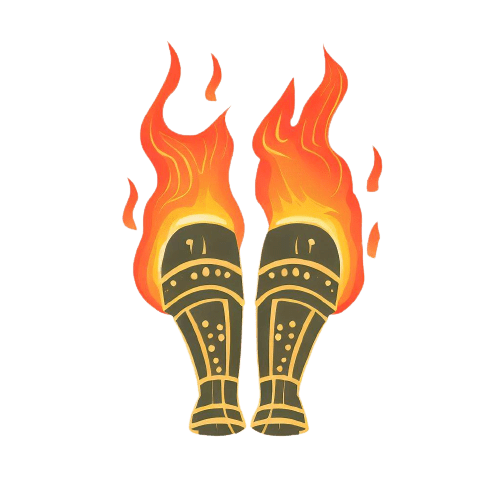 | 每一步都踏着烈焰 |
| 法棍 | 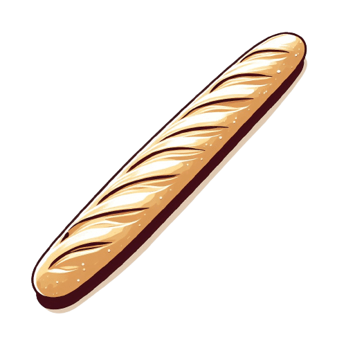 | 既可以食用，也可以作为攻击武器 |
| 金 | 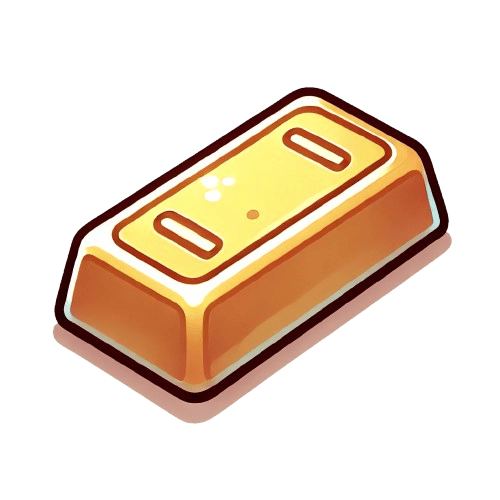 | 珍贵的金属，用于制造饰品和高级装备 |
| 银 | 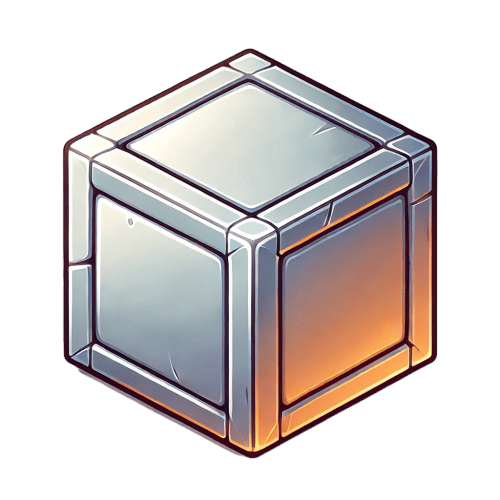 | 常见的贵金属，具有较高的延展性 |
| 铜 | 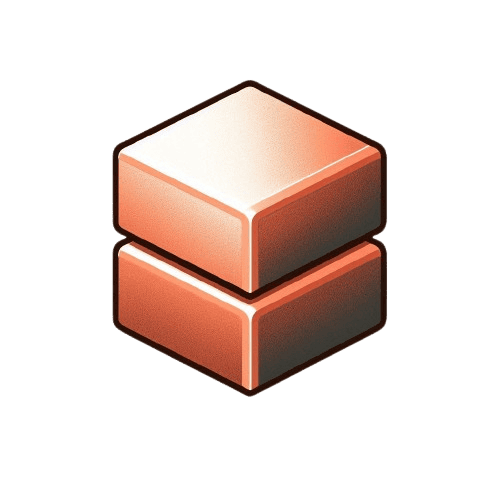 | 基础金属，可用于制造工具或武器 |
| 铁 | 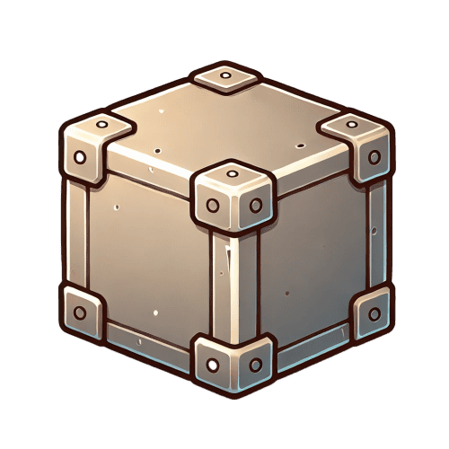 | 坚固的基础金属，是武器和盔甲的主要原料 |
| 钻石 | 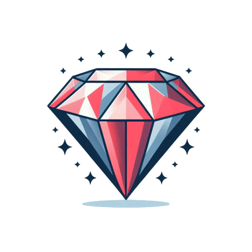 | 稀有而坚硬的矿石，代表永恒 |
| 圣杯碎片 | 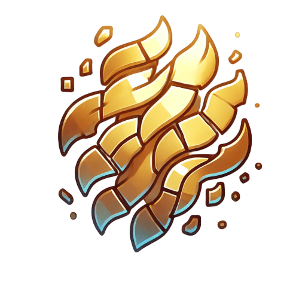 | 圣杯破碎后留下的碎片，神秘且稀有 |
| 火焰水晶 | 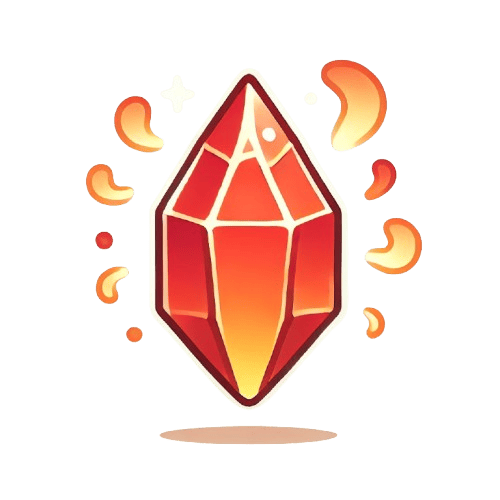 | 蕴含火焰能量的神秘水晶 |
| 暗影石 | 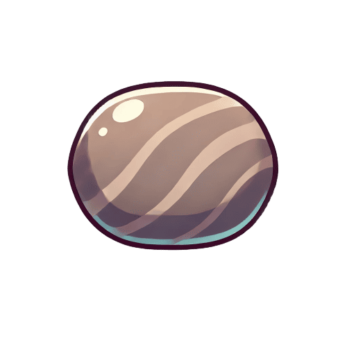 | 从黑暗深处提炼出的神秘矿石 |
| 魔法草 |  | 一种生长于隐秘森林的草药，具有奇特的魔力 |
| 远古木材 | 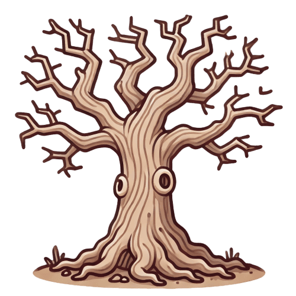 | 坚韧且带有神秘气息的木材 |
| 水晶碎片 | 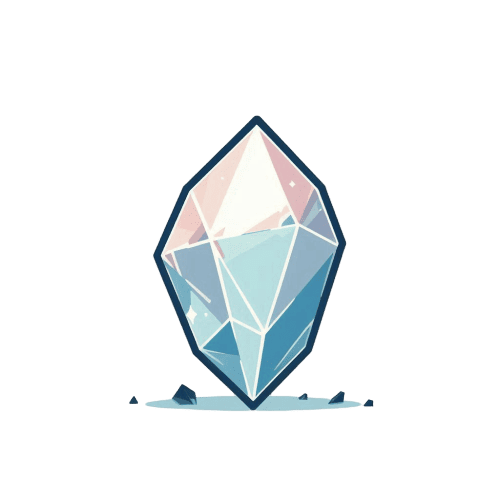 | 透明而坚硬的碎片，闪耀着奇异的光辉 |
| 黑珍珠 | 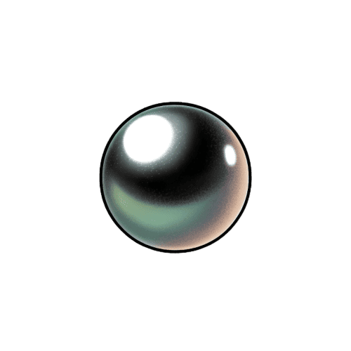 | 稀有的深海产物，充满神秘气息 |
| 神秘之爪 | 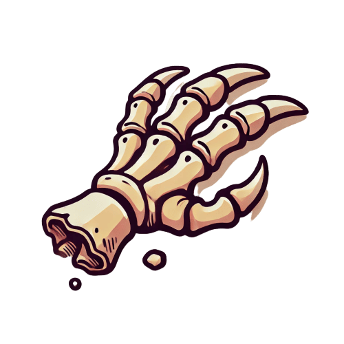 | 未知生物遗留的爪子，充满力量 |
| 龙鳞 | 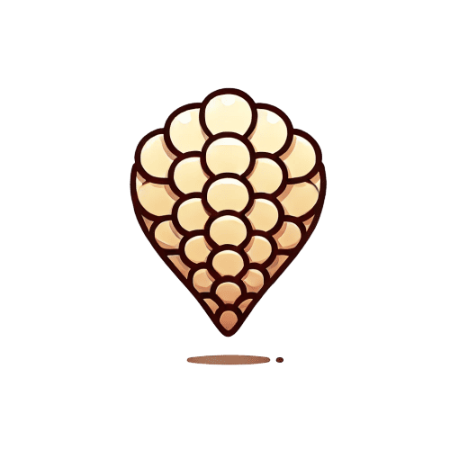 | 传说中的龙鳞片，极其坚固且带有魔法能量 |
| 皮革 | 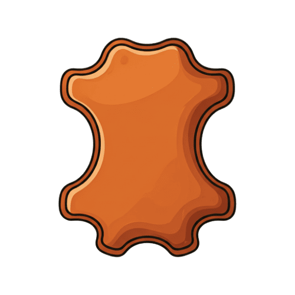 | 柔软且坚韧的材料，用于制作盔甲和其他物品 |
| 镜子碎片 | 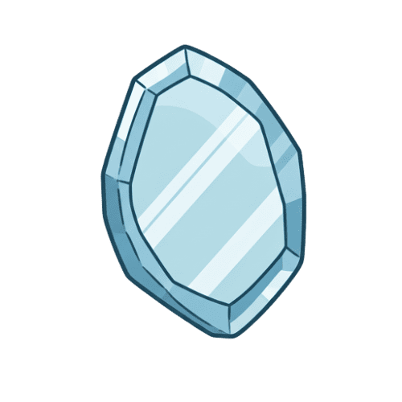 | 破碎的镜子碎片，据说具有神秘力量 |
| 魔法粉尘 | 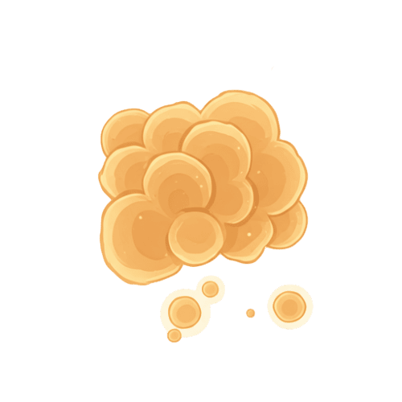 | 发光的粉尘，常用于魔法道具 |
| 丝线 |  | 细腻的线，可以用来缝制高级物品 |
| 羽毛 | 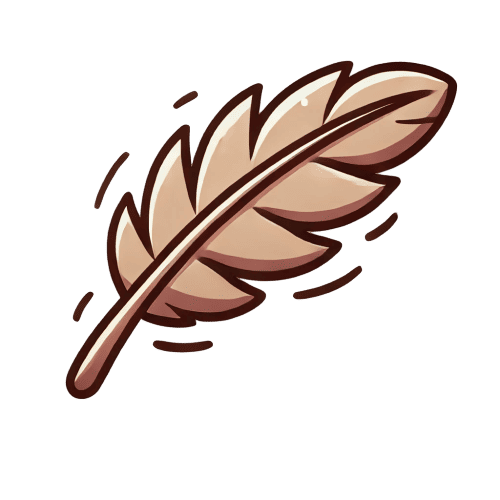 | 普通的羽毛，可用于制作装饰品或轻便装备 |
| 龙之血 | 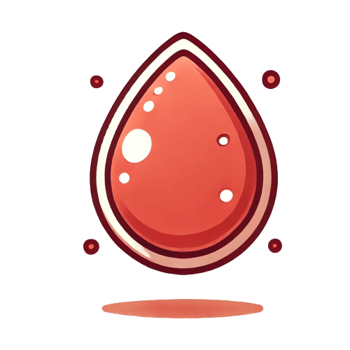 | 稀有而强大的材料，传说中用于制作最强大的武器 |
| 冰霜水晶 | 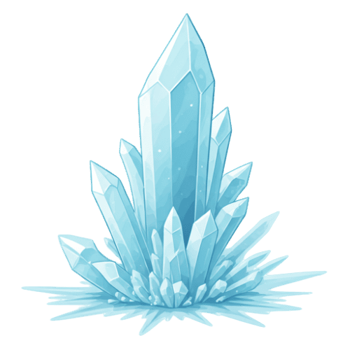 | 散发着寒冷气息的神秘水晶 |
