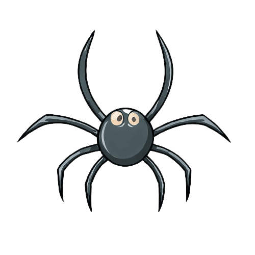

| 精灵名称 | 图像                                                         | 介绍                                                                                                                                                                      |
| -------- | ------------------------------------------------------------ |-------------------------------------------------------------------------------------------------------------------------------------------------------------------------|
| 玩家     |  | 玩家                                                                                                                                                                      |
| 狗狗     |  | <ul><li>黎明和黄昏时在商店周围刷新</li><li>没有被驯服的狗会在地图上随机游走</li><li>被驯服的狗会跟随主人移动</li><li>会攻击攻击者（即使攻击者是主人）</li><li>会保护主人，辅助主人攻击敌人</li><li>喜爱骨头，可以用骨头驯服和喂食</li><li>死亡时可能掉落骨头</li></ul> |
| 蜘蛛     |  | <ul><li>晚上在树周围刷新</li><li>会在地图上随机游走</li><li>会主动攻击附近的精灵</li><li>死亡时可能掉落木棍和面包</li><li>黎明和白天受到阳光持续烧伤</li></ul>                                                              |
| 地缚灵 |  | <ul><li>晚上在墓碑周围刷新</li><li>会在精神病院周围随机游走</li><li>不会主动攻击附近的精灵，但当自己或其他周围的地缚灵受到攻击时会反击</li><li>死亡时小概率掉落隐身帽</li><li>黎明和白天受到阳光持续烧伤</li></ul>                                    |

